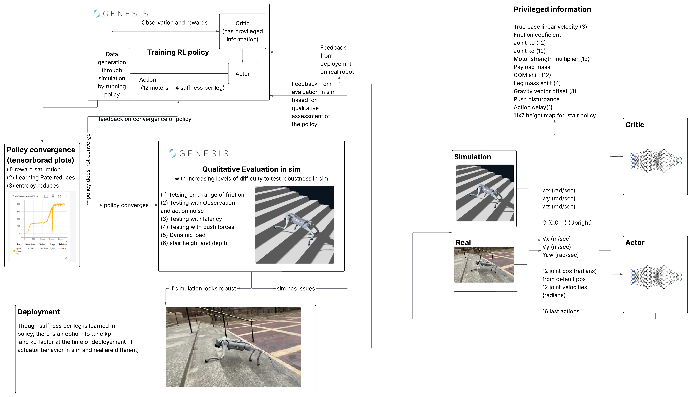

# Go2 Sim-to-Real Locomotion RL

Reinforcement learning locomotion policies for the Unitree Go2 quadruped robot, trained in the [Genesis](https://genesis-world.readthedocs.io/) physics simulator. This repo covers the **simulation and training side** — four behaviors are trained: omnidirectional walking, stair climbing, crouching, and jumping. Walking and stair climbing achieve successful sim-to-real transfer.

For hardware deployment, see the companion repo: [go2-sim2real-deploy](https://github.com/saifahmadgit/go2-sim2real-deploy)

**Full write-up:** [Project Page](https://saifahmadgit.github.io/projects/quadruped-locomotion-rl/)

[](https://www.youtube.com/watch?v=nrwN8KrsD2c)
▶ Click to watch on YouTube

---

## Setup

1. Clone the repo
   ```bash
   git clone git@github.com:saifahmadgit/go2-sim2real-locomotion-rl.git
   ```

2. Create virtual env
   ```bash
   cd ~/go2-sim2real-locomotion-rl
   python3 -m venv venv
   source venv/bin/activate
   ```

3. Install package
   ```bash
   pip install -e .
   ```

4. Install rsl-rl
   ```bash
   pip install rsl-rl-lib==2.2.4
   ```

5. Install pynput (for teleoperation during eval)
   ```bash
   pip install pynput
   ```

6. Install tensorboard (for monitoring training)
   ```bash
   pip install tensorboard
   ```

7. Keep the `logs/` directory at the same level as the script you run — both training and eval scripts search for logs relative to the working directory.

8. Training — for stair training, initialize from the walk checkpoint using `--resume`. Walk and stair envs are custom; jump and crouch use the base Genesis env with modifications.

   Walk:
   ```bash
   python3 examples/locomotion/final/go2_train_walk.py -e test1 --max_iterations 100
   ```

   Stair:
   ```bash
   python3 examples/locomotion/final/go2_train_stair.py -e test1 --max_iterations 100 --resume logs/go2-walk/model_188000.pt
   ```

   Crouch:
   ```bash
   python3 examples/locomotion/final/go2_train_crouch.py -e test1 --max_iterations 100
   ```

   Jump:
   ```bash
   python3 examples/locomotion/final/go2_train_crouch.py -e test1 --max_iterations 100
   ```

9. Evaluation — working checkpoints are included in the repo and can be run directly.

   Controls: `P` forward · `M` backward · `J/K` lateral · `U/O` yaw

   Walk:
   ```bash
   python3 examples/locomotion/final/go2_eval_walk.py -e go2-walk --ckpt 188000
   ```

   Stairs:
   ```bash
   python3 examples/locomotion/final/go2_eval_stairs.py -e go2-stairs --ckpt 104000
   ```

   Crouch:
   ```bash
   python3 examples/locomotion/final/go2_eval_base.py -e go2-crouch --ckpt 2999
   ```

   Jump:
   ```bash
   python3 examples/locomotion/final/go2_eval_base.py -e go2-jump --ckpt 999
   ```

---

## Implementation Details



### Architecture

An **asymmetric actor-critic** design closes the sim-to-real gap without requiring privileged information at deployment:

- **Actor** — constrained to 49 proprioceptive signals available on hardware: IMU, joint encoders, last action
- **Critic** — receives full privileged state during training only: friction, velocity, mass, push forces, terrain heights

Network: MLP with ELU activation, hidden dims `[512, 256, 128]`

### Training Pipeline

1. Genesis simulation with **4,096 parallel environments**
2. Convergence check via TensorBoard (reward curves + entropy)
3. Visual policy inspection / stress testing
4. Hardware deployment with iterative feedback

---

## Part I: Omnidirectional Walking

### Simulation Parameters

| Parameter | Value |
|---|---|
| Control frequency | 50 Hz (0.02 s timestep) |
| Physics substeps | 2 per control step |
| Episode length | 20 seconds |
| Parallel environments | 4,096 |
| Standing environments | 10% |
| Learning rate | 1 × 10⁻³ |
| Clip parameter | 0.2 |
| Discount factor (γ) | 0.99 |
| GAE λ | 0.95 |
| Max iterations | 10,000 |

### Action Space

The policy outputs **16 actions**: 12 joint position targets (hip/thigh/calf × 4 legs) + 4 per-leg stiffness scalars.

### Per-Leg Adaptive Stiffness

Inspired by [arXiv:2502.09436](https://arxiv.org/abs/2502.09436), the policy learns one stiffness scalar per leg. Damping is derived as `Kd = 0.2 × √Kp`, allowing the policy to emergently stiffen stance legs and soften swing legs.

| Parameter | Value |
|---|---|
| Kp range (training) | [10, 70] Nm/rad |
| Kp default | 40 Nm/rad |
| Action scale | 20 |
| Kp range (deployment) | [20, 60] Nm/rad |

### Domain Randomization

Parameters are randomized across a curriculum level from 0 to 1.0:

| Parameter | Level 0 Range | Level 1.0 Range |
|---|---|---|
| Ground friction | [0.6, 0.8] | [0.3, 1.25] |
| Kp factor | [0.95, 1.05] | [0.8, 1.2] |
| Kd factor | [0.95, 1.05] | [0.8, 1.2] |
| Motor strength | [0.97, 1.03] | [0.9, 1.1] |
| Trunk mass shift | [−0.2, +0.5] kg | [−1.0, +3.0] kg |
| CoM shift | ±0.005 m | ±0.03 m |
| Per-leg hip mass | ±0.1 kg | ±0.5 kg |
| Gravity offset | ±0.2 m/s² | ±1.0 m/s² |
| Obs noise (ang vel) | — | ±0.2 rad/s |
| Obs noise (DOF pos) | — | ±0.01 rad |
| Obs noise (DOF vel) | — | ±1.5 rad/s |
| Action noise | — | std = 0.1 |
| External push forces | None | ±150 N every 5 s (0.05–0.2 s) |
| Action delay | 0 steps | 0–1 steps (0–20 ms) |

Global parameters re-randomize every 200 resets to maintain consistency during PPO rollouts.

### Metric-Gated Curriculum

Adding all disturbances simultaneously causes PPO divergence. A metric-gated curriculum increases difficulty only after sustained performance:

| Metric | EMA α | Level-Up Threshold | Level-Down Threshold |
|---|---|---|---|
| Timeout rate | 0.03 | ≥ 0.80 | — |
| Velocity tracking score | 0.03 | ≥ 0.75 | — |
| Fall rate | 0.03 | — | ≥ 0.25 |

Level changes are asymmetric: +0.01 up, −0.03 down. 5-update cooldown between changes. 80% of environments sample current difficulty; 20% sample from the lower band [0.0, 0.5].

### Reward Function

| Term | Scale | Role |
|---|---|---|
| tracking_lin_vel | +1.5 | Track commanded linear velocity |
| tracking_ang_vel | +0.8 | Track commanded yaw rate |
| lin_vel_z | −2.0 | Penalize vertical base movement |
| base_height | −0.6 | Maintain nominal height (0.3 m target) |
| orientation_penalty | −5.0 | Penalize roll and pitch |
| ang_vel_xy | −0.05 | Penalize rolling/pitching rate |
| action_rate | −0.01 | Penalize rapid action changes |
| similar_to_default | −0.1 | Regularize toward default joint pose |
| dof_acc | −2.5 × 10⁻⁷ | Penalize joint accelerations |
| dof_vel | −5 × 10⁻⁴ | Penalize joint velocities |
| feet_air_time | +0.2 | Reward appropriate foot lift (0.1 s target) |
| foot_slip | −0.1 | Penalize foot slipping on contact |
| foot_clearance | −0.1 | Penalize insufficient foot height |
| joint_tracking | −0.1 | Penalize joint target error |
| stand_still | −0.5 | Penalize motion when command ≈ 0 |
| stand_still_vel | −2.0 | Penalize velocity when command ≈ 0 |
| feet_stance | −0.3 | Encourage proper stance timing |

---

## Part II: Stair Climbing

Initialized from the walking checkpoint and fine-tuned at a lower learning rate (3 × 10⁻⁴). The critic receives an additional **11 × 7 height scan** (77 points, ±0.5 m forward/backward, ±0.3 m lateral) for terrain context. The actor remains proprioceptive-only at deployment.

### Terrain Curriculum

| Parameter | Value |
|---|---|
| Difficulty levels | 13 rows |
| Step height range | 2 cm (row 0) → 15 cm (row 12) |
| Step depth (tread) | 39 cm |
| Steps per flight | 6 up + 6 down |
| Flights per row | 4 up-down cycles |
| Heightfield resolution | 5 cm horizontal, 0.5 cm vertical |
| Episode length | 25 seconds |
| Training start level | 0.65 (~row 8) |

Spawn distribution: 40% frontier / 30% near-frontier / 30% easy.

| Metric | Advance Threshold | Retreat Threshold |
|---|---|---|
| Timeout rate | ≥ 0.60 | — |
| Tracking score | ≥ 0.45 | — |
| Fall rate | ≤ 0.35 | ≥ 0.40 |

### Reward Modifications for Stairs

| Term | Walking | Stairs | Reason |
|---|---|---|---|
| forward_progress | — | +0.4 | Direct ascent incentive |
| orientation | roll + pitch | roll only (−5.0) | Pitch expected during ascent |
| lin_vel_z | −2.0 | −1.0 + 0.15 m/s deadzone | Allow upward body velocity |
| base_height | −0.6 | −0.1 | Freedom on uneven terrain |
| similar_to_default | −0.1 | −0.05 | Stair postures deviate naturally |
| foot_clearance | −0.1 | −0.5 (terrain-relative) | Clear step edges |
| feet_height_target | 0.075 m | 0.17 m | Higher foot lift required |

Two-phase DR: Phase 1 (terrain curriculum < 0.5) caps DR at 0.15 so the robot focuses on the stair task; Phase 2 ramps DR to full ceiling for robustness.

---

## References

- [Extreme Parkour with Legged Robots](https://arxiv.org/abs/2309.14341) — asymmetric actor-critic, privileged observations, domain randomization
- [Variable Stiffness for Robust Locomotion through RL](https://arxiv.org/abs/2502.09436) — per-leg adaptive stiffness
